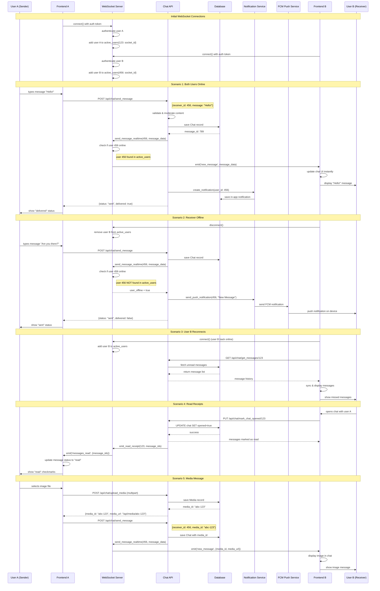

# WebSocket Chat System - Sequence Diagram

## Key Components

### **WebSocket Server**
- Maintains `active_users` map: `{user_id: socket_id}`
- Handles connect/disconnect events
- Routes real-time messages to online users

### **Chat API**
- Validates and moderates messages
- Saves to database for persistence
- Attempts WebSocket delivery first
- Falls back to push notifications for offline users

### **Notification Service**
- Creates in-app notifications (always)
- Sends push notifications (only if user offline)
- Respects user notification preferences

### **Database**
- Stores all messages permanently
- Tracks read status with `opened` field
- Supports media attachments via `media_id`

## Message States

1. **Sent**: Message saved to database
2. **Delivered**: Message reached recipient (WebSocket or push)
3. **Read**: Recipient opened the chat and viewed message

## Offline Handling

- **Online**: Instant WebSocket delivery
- **Offline**: Push notification + database storage
- **Reconnect**: Sync from database on reconnection