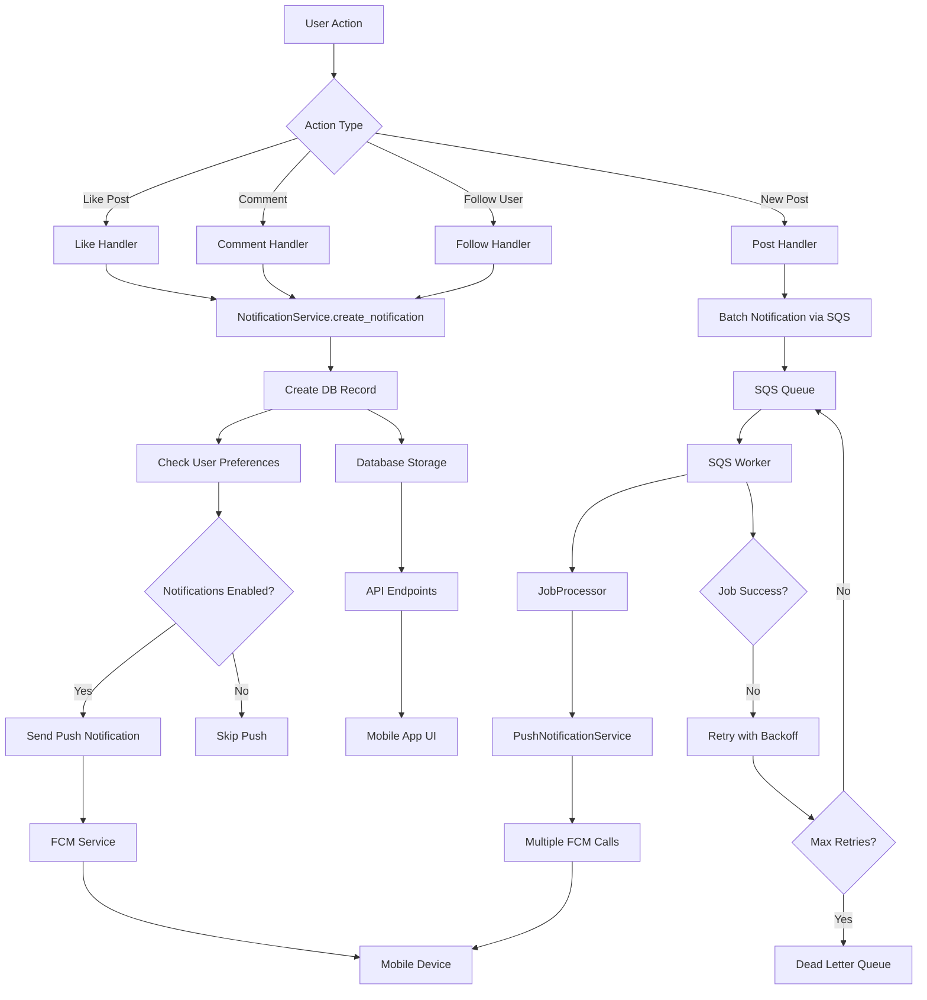
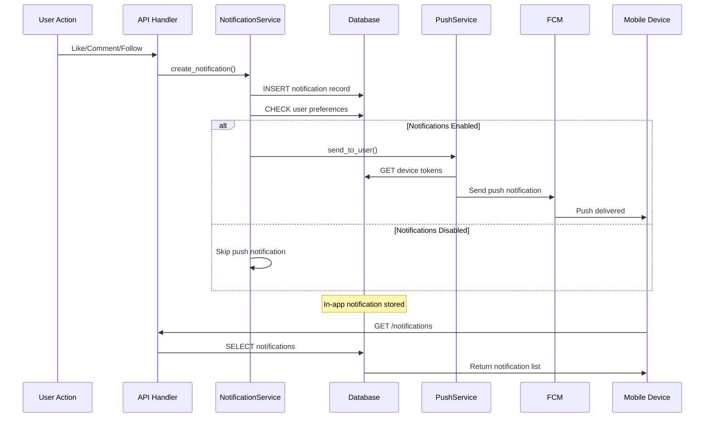
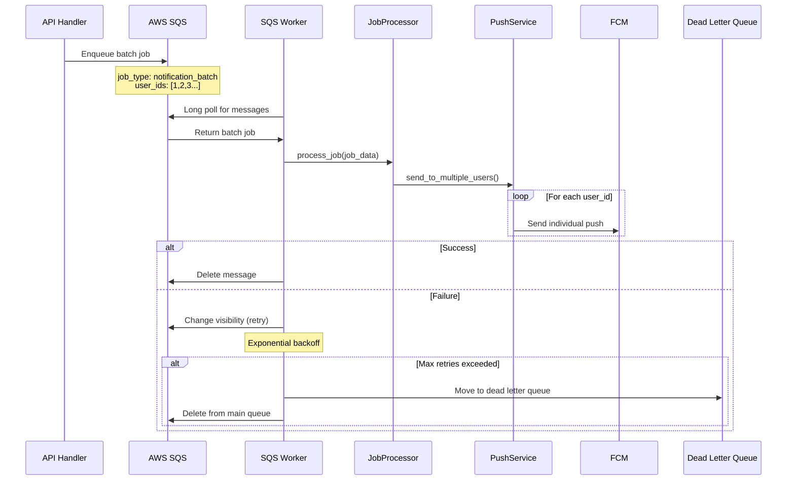
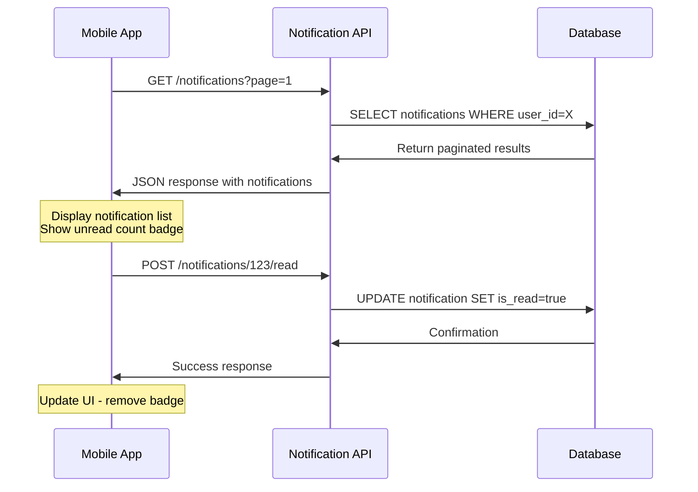

# YesLove Notification Service - End-to-End Flow

## Architecture Overview

## Detailed Flow Diagrams

### 1. Single User Notification Flow

### 2. Batch Notification Flow (High Volume)

### 3. In-App Notification Retrieval

## Component Responsibilities

### Database Layer
- **Notification Table**: Persistent storage for all notifications
- **DeviceToken Table**: FCM tokens for push delivery
- **NotificationSettings Table**: User preferences per notification type

### Service Layer
- **NotificationService**: Core business logic for notification creation
- **PushNotificationService**: FCM integration and device token management
- **SQSService**: Queue management for batch processing

### Worker Layer
- **SQSWorker**: Long-polling message consumer
- **JobProcessor**: Job type routing and execution
- **Retry Logic**: Exponential backoff and DLQ handling

### API Layer
- **Notification Routes**: REST endpoints for mobile app
- **Integration Points**: Like/comment/follow handlers

## Data Flow Summary

1. **Trigger**: User performs action (like, comment, follow)
2. **Route**: API handler calls NotificationService
3. **Persist**: Notification saved to database
4. **Check**: User preferences validated
5. **Push**: FCM notification sent (if enabled)
6. **Retrieve**: Mobile app fetches via API
7. **Display**: In-app notification shown to user
8. **Mark Read**: User interaction updates read status

## Error Handling & Resilience

- **Database Failures**: Rollback notification creation
- **FCM Failures**: Log error, continue with in-app notification
- **SQS Failures**: Retry with exponential backoff
- **Worker Failures**: Move to DLQ after max retries
- **Graceful Shutdown**: Signal handling for worker processes