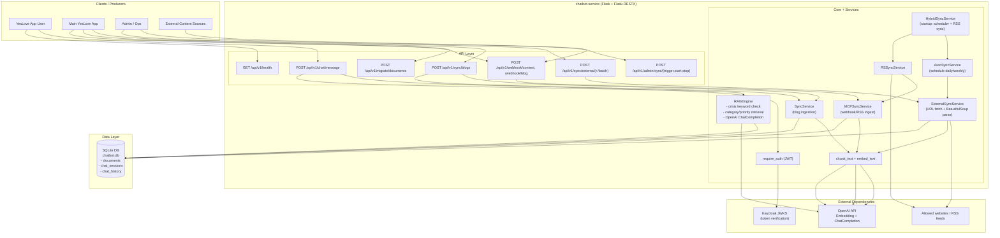

# Chatbot Service Current Implementation Architecture

```mermaid
flowchart TB
    subgraph Clients["Clients / Producers"]
        U1["YesLove App User"]
        U2["Main YesLove App"]
        U3["Admin / Ops"]
        U4["External Content Sources"]
    end

    subgraph Service["chatbot-service (Flask + Flask-RESTX)"]
        subgraph API["API Layer"]
            A1["POST /api/v1/chat/message"]
            A2["POST /api/v1/sync/blogs"]
            A3["POST /api/v1/migrate/documents"]
            A4["POST /api/v1/sync/external(+/batch)"]
            A5["POST /api/v1/webhook/content, /webhook/blog"]
            A6["POST /api/v1/admin/sync/{trigger,start,stop}"]
            A7["GET /api/v1/health"]
        end

        subgraph Core["Core + Services"]
            C1["require_auth (JWT)"]
            C2["RAGEngine\n- crisis keyword check\n- category/priority retrieval\n- OpenAI ChatCompletion"]
            C3["SyncService\n(blog ingestion)"]
            C4["ExternalSyncService\n(URL fetch + BeautifulSoup parse)"]
            C5["MCPSyncService\n(webhook/RSS ingest)"]
            C6["RSSyncService"]
            C7["AutoSyncService\n(schedule daily/weekly)"]
            C8["HybridSyncService\n(startup: scheduler + RSS sync)"]
            C9["chunk_text + embed_text"]
        end
    end

    subgraph Data["Data Layer"]
        D1[("SQLite DB\nchatbot.db\n- documents\n- chat_sessions\n- chat_history")]
    end

    subgraph External["External Dependencies"]
        E1["OpenAI API\nEmbedding + ChatCompletion"]
        E2["Keycloak JWKS\n(token verification)"]
        E3["Allowed websites / RSS feeds"]
    end

    U1 --> A1
    U2 --> A2
    U2 --> A3
    U2 --> A5
    U3 --> A6
    U4 --> A5
    U3 --> A4
    U1 --> A7

    A1 --> C1 --> E2
    A1 --> C2
    C2 --> D1
    C2 --> E1

    A2 --> C3 --> C9 --> E1
    A2 --> C3 --> D1

    A4 --> C4 --> E3
    C4 --> C9 --> E1
    C4 --> D1

    A5 --> C5 --> C9 --> E1
    C5 --> D1

    C6 --> C5
    C6 --> E3
    C7 --> C4
    C8 --> C7
    C8 --> C6
```
