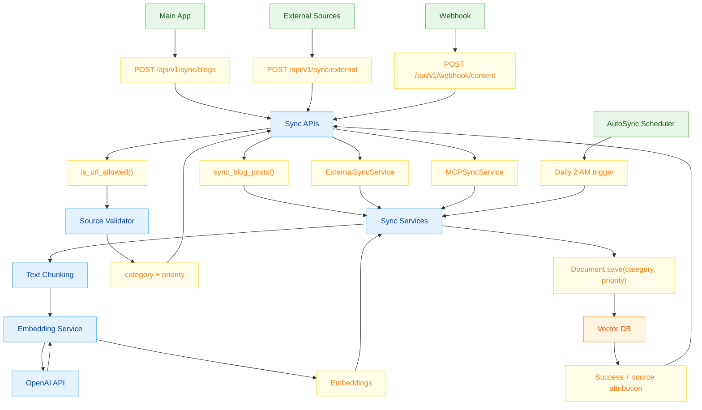
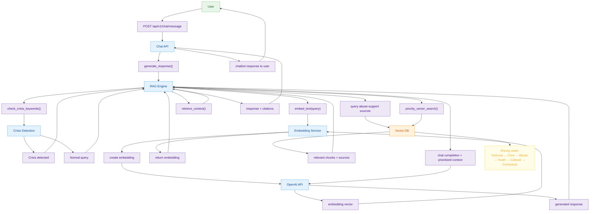

# Data Flow Diagrams

## Multi-Source Content Ingestion Flow

```mermaid
graph TD
    MA["Main App"]
    EXT["External Sources"]
    WH["Webhook"]
    AS["AutoSync Scheduler"]
    API["Sync APIs"]
    SV["Source Validator"]
    SS["Sync Services"]
    CH["Text Chunking"]
    ES["Embedding Service"]
    OAI["OpenAI API"]
    DB["Vector DB"]

    MA --> BLOG_CALL["POST /api/v1/sync/blogs"]
    BLOG_CALL --> API
    API --> BLOG_TASK["sync_blog_posts()"]
    BLOG_TASK --> SS

    EXT --> EXT_CALL["POST /api/v1/sync/external"]
    EXT_CALL --> API
    API --> URL_CHECK["is_url_allowed()"]
    URL_CHECK --> SV
    SV --> CATEGORY["category + priority"]
    CATEGORY --> API
    API --> EXT_TASK["ExternalSyncService"]
    EXT_TASK --> SS

    WH --> WH_CALL["POST /api/v1/webhook/content"]
    WH_CALL --> API
    API --> WH_TASK["MCPSyncService"]
    WH_TASK --> SS

    AS --> AS_TRIGGER["Daily 2 AM trigger"]
    AS_TRIGGER --> SS

    SS --> CH
    CH --> ES
    ES --> OAI
    OAI --> ES
    ES --> EMBEDS["Embeddings"]
    EMBEDS --> SS
    SS --> SAVE_DOC["Document.save(category, priority)"]
    SAVE_DOC --> DB
    DB --> RESULT["Success + source attribution"]
    RESULT --> API

    classDef actor fill:#e8f5e9,stroke:#66bb6a,color:#1b5e20;
    classDef service fill:#e3f2fd,stroke:#42a5f5,color:#0d47a1;
    classDef data fill:#fff3e0,stroke:#fb8c00,color:#e65100;
    classDef activity fill:#fffde7,stroke:#fdd835,color:#f57f17;
    class MA,EXT,WH,AS actor;
    class API,SV,SS,CH,ES,OAI service;
    class DB data;
    class BLOG_CALL,BLOG_TASK,EXT_CALL,URL_CHECK,CATEGORY,EXT_TASK,WH_CALL,WH_TASK,AS_TRIGGER,EMBEDS,SAVE_DOC,RESULT activity;
```

## Priority-Based Chat Query Flow

```mermaid
graph TD
    U["User"]
    API["Chat API"]
    RAG["RAG Engine"]
    CD["Crisis Detection"]
    ES["Embedding Service"]
    OAI["OpenAI API"]
    DB["Vector DB"]

    U --> CHAT_CALL["POST /api/v1/chat/message"]
    CHAT_CALL --> API
    API --> GEN_REQ["generate_response()"]
    GEN_REQ --> RAG
    RAG --> CRISIS_CHECK["check_crisis_keywords()"]
    CRISIS_CHECK --> CD

    CD --> CRISIS["Crisis detected"]
    CRISIS --> RAG
    RAG --> ABUSE_QUERY["query abuse-support sources"]
    ABUSE_QUERY --> DB

    CD --> NORMAL["Normal query"]
    NORMAL --> RAG
    RAG --> EMBED_REQ["embed_text(query)"]
    EMBED_REQ --> ES
    ES --> EMBED_CALL["create embedding"]
    EMBED_CALL --> OAI
    OAI --> EMBED_VECTOR["embedding vector"]
    EMBED_VECTOR --> ES
    ES --> EMBED_RETURN["return embedding"]
    EMBED_RETURN --> RAG
    RAG --> PRIORITY_QUERY["priority_vector_search()"]
    PRIORITY_QUERY --> DB

    DB --> CONTEXT["relevant chunks + sources"]
    CONTEXT --> RAG
    RAG --> CONTEXT_BUILD["retrieve_context()"]
    CONTEXT_BUILD --> RAG
    RAG --> COMPLETION["chat completion + prioritized context"]
    COMPLETION --> OAI
    OAI --> RESPONSE["generated response"]
    RESPONSE --> RAG
    RAG --> FINAL["response + citations"]
    FINAL --> API
    API --> USER_RETURN["chatbot response to user"]
    USER_RETURN --> U

    PRIORITY["Priority order:<br/>YesLove → Core → Abuse → Youth → Cultural → Contextual"]
    DB --> PRIORITY

    classDef actor fill:#e8f5e9,stroke:#66bb6a,color:#1b5e20;
    classDef service fill:#e3f2fd,stroke:#42a5f5,color:#0d47a1;
    classDef data fill:#fff3e0,stroke:#fb8c00,color:#e65100;
    classDef note fill:#fffde7,stroke:#fdd835,color:#f9a825;
    classDef activity fill:#ede7f6,stroke:#7e57c2,color:#4a148c;
    class U actor;
    class API,RAG,CD,ES,OAI service;
    class DB data;
    class PRIORITY note;
    class CHAT_CALL,GEN_REQ,CRISIS_CHECK,CRISIS,ABUSE_QUERY,NORMAL,EMBED_REQ,EMBED_CALL,EMBED_VECTOR,EMBED_RETURN,PRIORITY_QUERY,CONTEXT,CONTEXT_BUILD,COMPLETION,RESPONSE,FINAL,USER_RETURN activity;
```
