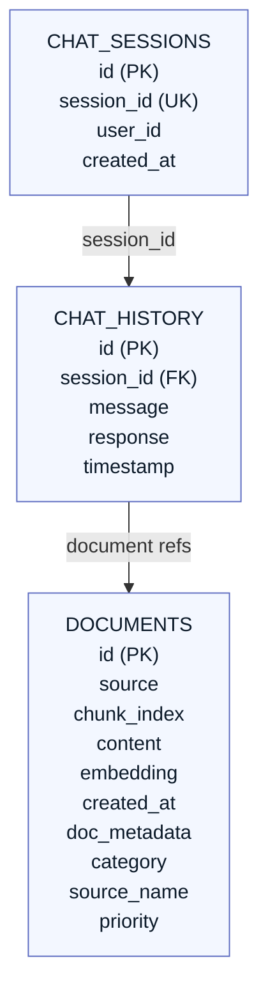
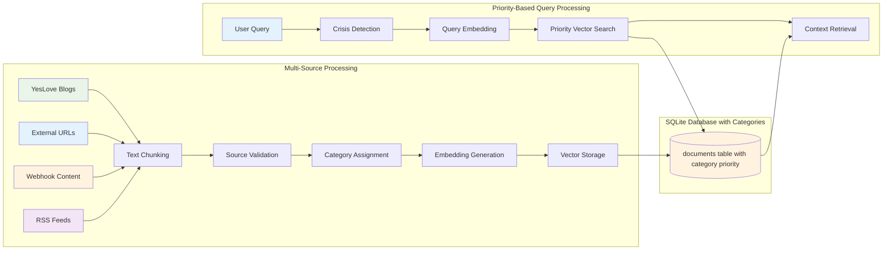

# Database Schema Diagram

```mermaid
graph TD
    DOCUMENTS["DOCUMENTS<br/>id (PK)<br/>source<br/>chunk_index<br/>content<br/>embedding<br/>created_at<br/>doc_metadata<br/>category<br/>source_name<br/>priority"]
    CHAT_SESSIONS["CHAT_SESSIONS<br/>id (PK)<br/>session_id (UK)<br/>user_id<br/>created_at"]
    CHAT_HISTORY["CHAT_HISTORY<br/>id (PK)<br/>session_id (FK)<br/>message<br/>response<br/>timestamp"]

    CHAT_SESSIONS -->|session_id| CHAT_HISTORY
    CHAT_HISTORY -->|document refs| DOCUMENTS

    classDef table fill:#f3f7ff,stroke:#5c6bc0,stroke-width:1px,color:#0d1b2a
    class DOCUMENTS,CHAT_SESSIONS,CHAT_HISTORY table;
```

## Enhanced Vector Storage Architecture

```mermaid
graph LR
    subgraph "Multi-Source Processing"
        A[YesLove Blogs] --> B[Text Chunking]
        A1[External URLs] --> B
        A2[Webhook Content] --> B
        A3[RSS Feeds] --> B
        B --> C[Source Validation]
        C --> D[Category Assignment]
        D --> E[Embedding Generation]
        E --> F[Vector Storage]
    end
    
    subgraph "Priority-Based Query Processing"
        G[User Query] --> H[Crisis Detection]
        H --> I[Query Embedding]
        I --> J[Priority Vector Search]
        J --> K[Context Retrieval]
    end
    
    subgraph "SQLite Database with Categories"
        F --> L[(documents table with category priority)]
        J --> L
        L --> K
    end
    
    style A fill:#e8f5e8
    style A1 fill:#e3f2fd
    style A2 fill:#fff3e0
    style A3 fill:#f3e5f5
    style G fill:#e3f2fd
    style L fill:#fff3e0
```
