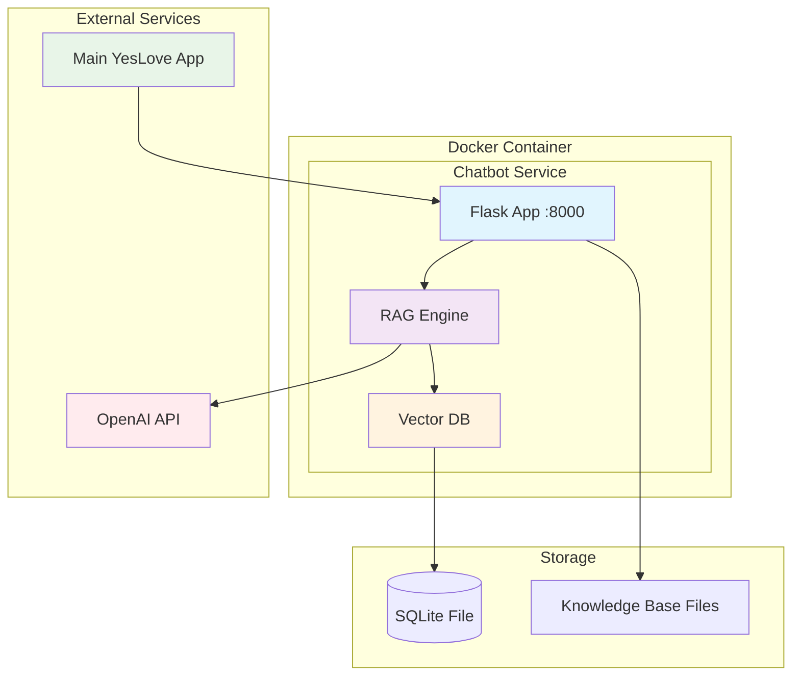
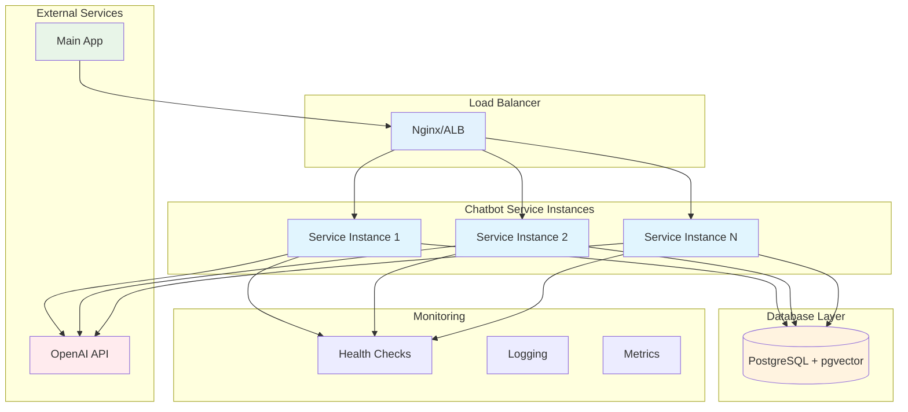

# Deployment Architecture

## Standalone Deployment

```mermaid
graph TB
    subgraph "Docker Container"
        subgraph "Chatbot Service"
            A[Flask App :8000]
            B[RAG Engine]
            C[Vector DB]
        end
    end
    
    subgraph "External Services"
        D[OpenAI API]
        E[Main YesLove App]
    end
    
    subgraph "Storage"
        F[(SQLite File)]
        G[Knowledge Base Files]
    end
    
    A --> B
    B --> C
    C --> F
    B --> D
    E --> A
    A --> G
    
    style A fill:#e1f5fe
    style B fill:#f3e5f5
    style C fill:#fff3e0
    style D fill:#ffebee
    style E fill:#e8f5e8
```

## Production Architecture

```mermaid
graph TB
    subgraph "Load Balancer"
        LB[Nginx/ALB]
    end
    
    subgraph "Chatbot Service Instances"
        CS1[Service Instance 1]
        CS2[Service Instance 2]
        CS3[Service Instance N]
    end
    
    subgraph "Database Layer"
        PG[(PostgreSQL + pgvector)]
    end
    
    subgraph "External Services"
        OAI[OpenAI API]
        MAIN[Main App]
    end
    
    subgraph "Monitoring"
        MON[Health Checks]
        LOGS[Logging]
        METRICS[Metrics]
    end
    
    LB --> CS1
    LB --> CS2
    LB --> CS3
    CS1 --> PG
    CS2 --> PG
    CS3 --> PG
    CS1 --> OAI
    CS2 --> OAI
    CS3 --> OAI
    MAIN --> LB
    CS1 --> MON
    CS2 --> MON
    CS3 --> MON
    
    style LB fill:#e3f2fd
    style CS1 fill:#e1f5fe
    style CS2 fill:#e1f5fe
    style CS3 fill:#e1f5fe
    style PG fill:#fff3e0
    style OAI fill:#ffebee
    style MAIN fill:#e8f5e8
```
