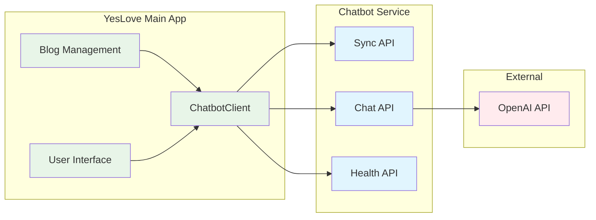
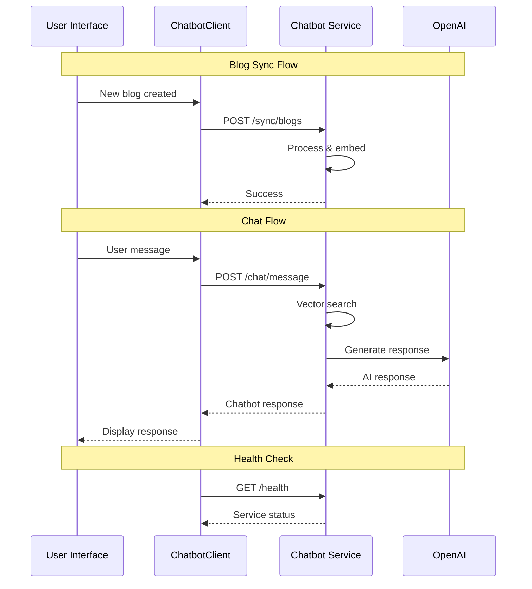
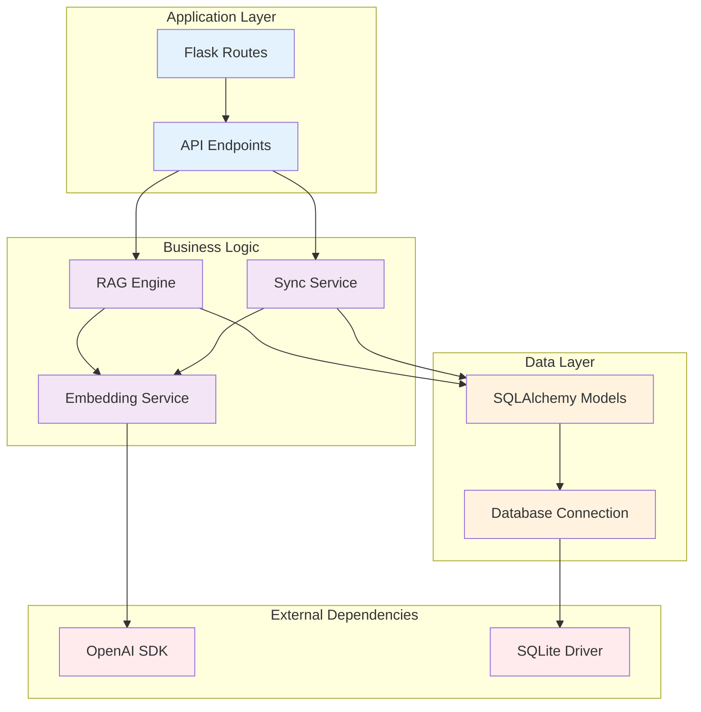

# Integration Architecture

## Main App Integration

```mermaid
flowchart LR
    subgraph "YesLove Main App"
        A[Blog Management]
        B[User Interface]
        C[ChatbotClient]
    end
    
    subgraph "Chatbot Service"
        D[Sync API]
        E[Chat API]
        F[Health API]
    end
    
    subgraph "External"
        G[OpenAI API]
    end
    
    A --> C
    B --> C
    C --> D
    C --> E
    C --> F
    E --> G
    
    style A fill:#e8f5e8
    style B fill:#e8f5e8
    style C fill:#e8f5e8
    style D fill:#e1f5fe
    style E fill:#e1f5fe
    style F fill:#e1f5fe
    style G fill:#ffebee
```

## API Integration Flow

```mermaid
sequenceDiagram
    participant UI as User Interface
    participant CC as ChatbotClient
    participant CS as Chatbot Service
    participant OAI as OpenAI
    
    Note over UI,OAI: Blog Sync Flow
    UI->>CC: New blog created
    CC->>CS: POST /sync/blogs
    CS->>CS: Process & embed
    CS-->>CC: Success
    
    Note over UI,OAI: Chat Flow
    UI->>CC: User message
    CC->>CS: POST /chat/message
    CS->>CS: Vector search
    CS->>OAI: Generate response
    OAI-->>CS: AI response
    CS-->>CC: Chatbot response
    CC-->>UI: Display response
    
    Note over UI,OAI: Health Check
    CC->>CS: GET /health
    CS-->>CC: Service status
```

## Component Dependencies

```mermaid
flowchart TB
    subgraph "Application Layer"
        A[Flask Routes]
        B[API Endpoints]
    end
    
    subgraph "Business Logic"
        C[RAG Engine]
        D[Sync Service]
        E[Embedding Service]
    end
    
    subgraph "Data Layer"
        F[SQLAlchemy Models]
        G[Database Connection]
    end
    
    subgraph "External Dependencies"
        H[OpenAI SDK]
        I[SQLite Driver]
    end
    
    A --> B
    B --> C
    B --> D
    C --> E
    D --> E
    E --> H
    C --> F
    D --> F
    F --> G
    G --> I
    
    style A fill:#e3f2fd
    style B fill:#e3f2fd
    style C fill:#f3e5f5
    style D fill:#f3e5f5
    style E fill:#f3e5f5
    style F fill:#fff3e0
    style G fill:#fff3e0
    style H fill:#ffebee
    style I fill:#ffebee
```