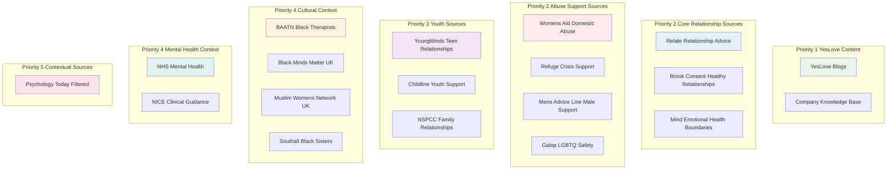
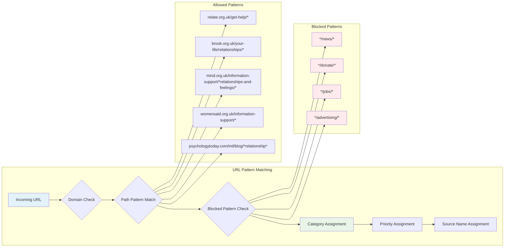

# Source Architecture Diagram

## Source Categories and Priorities

```mermaid
flowchart TB
    subgraph "Priority 1 YesLove Content"
        A[YesLove Blogs]
        A1[Company Knowledge Base]
    end
    
    subgraph "Priority 2 Core Relationship Sources"
        B[Relate Relationship Advice]
        B1[Brook Consent Healthy Relationships]
        B2[Mind Emotional Health Boundaries]
    end
    
    subgraph "Priority 2 Abuse Support Sources"
        C[Womens Aid Domestic Abuse]
        C1[Refuge Crisis Support]
        C2[Mens Advice Line Male Support]
        C3[Galop LGBTQ Safety]
    end
    
    subgraph "Priority 3 Youth Sources"
        D[YoungMinds Teen Relationships]
        D1[Childline Youth Support]
        D2[NSPCC Family Relationships]
    end
    
    subgraph "Priority 4 Cultural Context"
        E[BAATN Black Therapists]
        E1[Black Minds Matter UK]
        E2[Muslim Womens Network UK]
        E3[Southall Black Sisters]
    end
    
    subgraph "Priority 4 Mental Health Context"
        F[NHS Mental Health]
        F1[NICE Clinical Guidance]
    end
    
    subgraph "Priority 5 Contextual Sources"
        G[Psychology Today Filtered]
    end
    
    style A fill:#e8f5e8
    style B fill:#e3f2fd
    style C fill:#ffebee
    style D fill:#f3e5f5
    style E fill:#fff3e0
    style F fill:#e0f2f1
    style G fill:#fce4ec
```

## Source URL Patterns

```mermaid
flowchart LR
    subgraph "URL Pattern Matching"
        A[Incoming URL] --> B{Domain Check}
        B --> C{Path Pattern Match}
        C --> D{Blocked Pattern Check}
        D --> E[Category Assignment]
        E --> F[Priority Assignment]
        F --> G[Source Name Assignment]
    end
    
    subgraph "Allowed Patterns"
        H[relate.org.uk/get-help/*]
        I[brook.org.uk/your-life/relationships/*]
        J[mind.org.uk/information-support/*relationships-and-feelings/*]
        K[womensaid.org.uk/information-support/*]
        L[psychologytoday.com/intl/blog/*relationship*]
    end
    
    subgraph "Blocked Patterns"
        M[*/news/*]
        N[*/donate/*]
        O[*/jobs/*]
        P[*/advertising/*]
    end
    
    C --> H
    C --> I
    C --> J
    C --> K
    C --> L
    
    D --> M
    D --> N
    D --> O
    D --> P
    
    style A fill:#e3f2fd
    style E fill:#e8f5e8
    style M fill:#ffebee
    style N fill:#ffebee
    style O fill:#ffebee
    style P fill:#ffebee
```