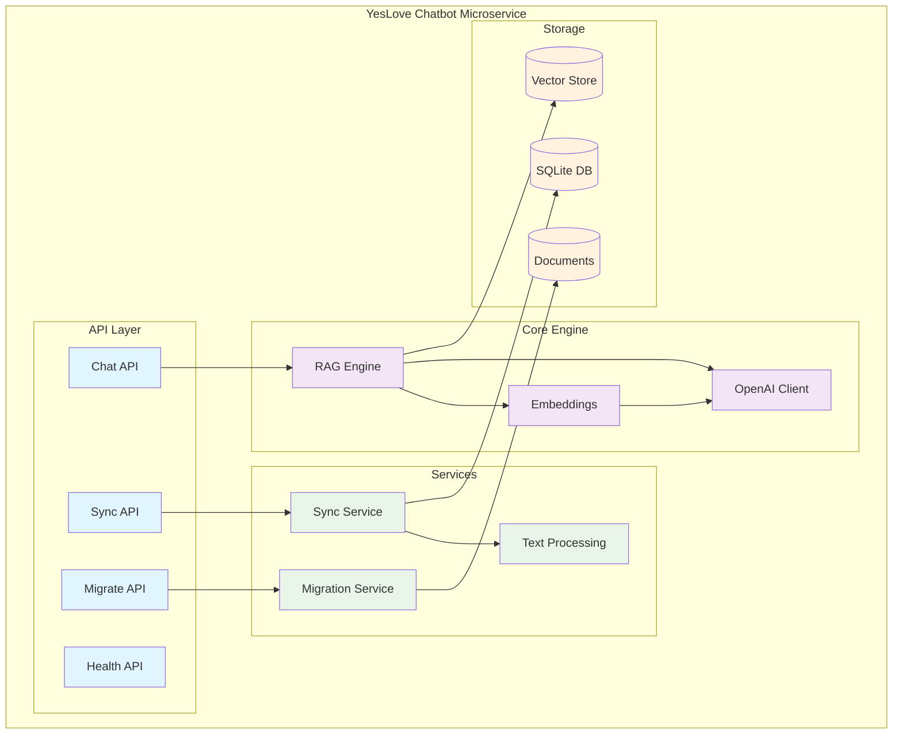

# System Overview Diagram

```mermaid
flowchart TB
    subgraph "YesLove Chatbot Microservice"
        subgraph "API Layer"
            A1[Chat API]
            A2[Sync API]
            A3[Health API]
            A4[Migrate API]
        end
        
        subgraph "Core Engine"
            B1[RAG Engine]
            B2[Embeddings]
            B3[OpenAI Client]
        end
        
        subgraph "Services"
            C1[Sync Service]
            C2[Text Processing]
            C3[Migration Service]
        end
        
        subgraph "Storage"
            D1[(SQLite DB)]
            D2[(Vector Store)]
            D3[(Documents)]
        end
    end
    
    A1 --> B1
    A2 --> C1
    A4 --> C3
    B1 --> B2
    B1 --> B3
    B2 --> B3
    C1 --> C2
    C1 --> D1
    B1 --> D2
    C3 --> D3
    
    style A1 fill:#e1f5fe
    style A2 fill:#e1f5fe
    style A3 fill:#e1f5fe
    style A4 fill:#e1f5fe
    style B1 fill:#f3e5f5
    style B2 fill:#f3e5f5
    style B3 fill:#f3e5f5
    style C1 fill:#e8f5e8
    style C2 fill:#e8f5e8
    style C3 fill:#e8f5e8
    style D1 fill:#fff3e0
    style D2 fill:#fff3e0
    style D3 fill:#fff3e0
```